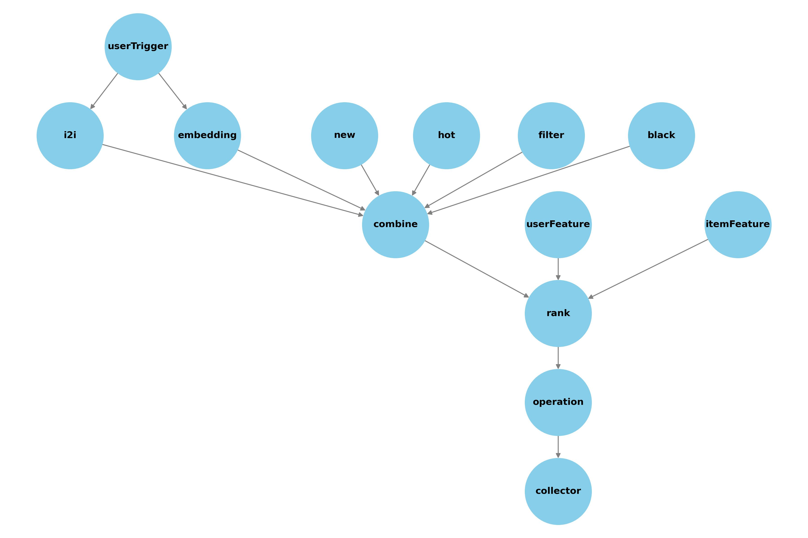

# rec-server

## contrib

User custom contribution module. Only support operation rule custom now.
After release the rec-server could load the plugin and exec the custom operation rule by config `operationName`

## graph

Async DAG tool package.

## proto

Common protocols with rec-client. Include recommend, query, push and operate.

## server

The real recommend online server.

### function point

<table>
	<tr>
	    <th>Biz</th>
	    <th>Detail</th>
	    <th>Status</th>  
	</tr >
	<tr >
	    <td rowspan="4">recall</td>
	    <td>i2i</td>
	    <td>✅</td>
	</tr>
	<tr>
	    <td>embedding</td>
	    <td>✅</td>
	</tr>
	<tr>
	    <td>hot</td>
	    <td>✅</td>
	</tr>
	<tr>
	    <td>new</td>
	    <td>✅</td>
	</tr>
    <tr >
	    <td rowspan="3">operation</td>
	    <td>blacklist</td>
	    <td>✅</td>
	</tr>
	<tr>
	    <td>exposure filter</td>
	    <td>✅</td>
	</tr>
	<tr>
	    <td>custom operation plugins</td>
	    <td>✅</td>
	</tr>
    <tr>
	    <td>rank</td>
	    <td>LR</td>
        <td>✅</td>
	</tr>
    <tr>
	    <td>tools</td>
	    <td>debug info</td>
        <td>✅</td>
	</tr>
</table>
