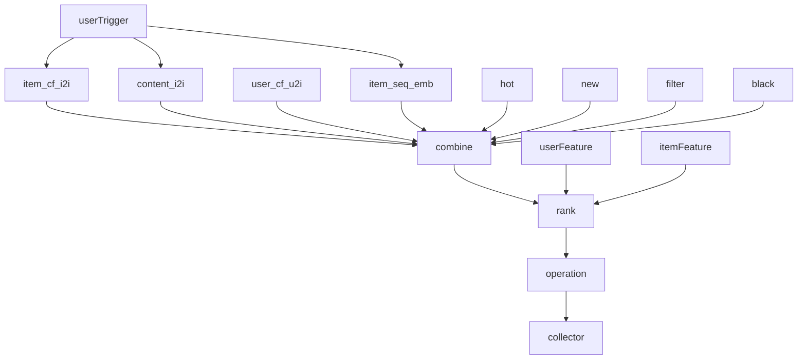

# rec-server

[](https://github.com/open-rec/rec-server/actions/workflows/ci.yml)


`rec-server` is OpenRec's online recommendation service. Each request executes a configurable DAG
that recalls, filters, combines, ranks, and post-processes candidates before returning items.

- Java 8, Spring Boot 2.3.1, and WebFlux
- Default port `13579`
- Redis for online entities, events, and filter state
- Elasticsearch for versioned recall tables and vector indexes

## Modules

| Directory | Artifact | Responsibility |
|---|---|---|
| [`graph`](graph) | `rec-graph` | Recommendation-independent asynchronous DAG runtime |
| [`proto`](proto) | `rec-proto` | Request, response, and entity types shared with clients |
| [`contrib`](contrib) | `rec-contrib` | PF4J operation-rule plugin |
| [`server`](server) | `rec-online-server` | HTTP service, recommendation nodes, and storage access |

The packaged default graph is defined in
[`graph.json`](server/src/main/resources/graph.json):


```mermaid
flowchart TD
    userTrigger --> item_cf_i2i
    userTrigger --> content_i2i
    userTrigger --> item_seq_emb

    item_cf_i2i --> combine
    content_i2i --> combine
    user_cf_u2i --> combine
    item_seq_emb --> combine
    hot --> combine
    new --> combine
    filter --> combine
    black --> combine

    combine --> rank
    userFeature --> rank
    itemFeature --> rank
    rank --> operation --> collector
```

## Build and run

```shell
mvn clean package -DskipTests
cd server
java -jar target/rec-server-1.0-SNAPSHOT.jar \
  --spring.profiles.active=standalone
```

Use `mvn clean install -DskipTests` when the Java SDK or example loader needs the local
`rec-proto` artifact.

The default graph uses the `rec-contrib` plugin. Before launching the jar directly, place it under
the server working directory:

```shell
mkdir -p server/plugins
cp contrib/target/rec-contrib-1.0-SNAPSHOT.jar server/plugins/
```

Alternatively, set an explicit path:

```shell
java -Dopenrec.operation.plugin=/path/to/rec-contrib.jar \
  -jar server/target/rec-server-1.0-SNAPSHOT.jar \
  --spring.profiles.active=standalone
```

The container build includes both the server and plugin. Start the corresponding
`bigdata-platform` mode first, then run one deployment:

```shell
docker compose -f docker-compose.standalone.yml up -d --build --wait
docker compose -f docker-compose.cluster.yml up -d --build --wait
```

- Standalone writes push requests directly to Redis and may bypass rank-engine.
- Cluster publishes push mutations to Kafka, calls rank-engine, and expects clients to report real
  exposures.

The complete initialization and acceptance flows live in `example/example_standalone` and
`example/example_cluster`.

## Quick check

```shell
curl http://localhost:13579/health

curl -s -X POST http://localhost:13579/api/recommend/item \
  -H 'Content-Type: application/json' -d '{
  "requestId": "test-1",
  "body": {
    "scene": "scene_0",
    "size": 10,
    "userId": "user_247",
    "deviceId": "d1",
    "type": "click",
    "debug": true
  }
}'
```

Swagger UI: <http://localhost:13579/swagger-ui/index.html>

## Serving graph and recall

Recall configuration separates graph identity, strategy identity, and storage routing:

| Field | Meaning |
|---|---|
| `name` | Graph node ID; it matches `recallType` for default recall nodes |
| `recallType` | Logical candidate channel used by combine, scoring, and diagnostics |
| `tableName` | Logical recall-store table or index family |

The default graph enables these channels:

| Channel | Lookup |
|---|---|
| `item_cf_i2i` | `I2iNode`: trigger item to item-CF candidates in `item-cf-i2i` |
| `content_i2i` | `I2iNode`: trigger item to content-similar candidates in `content-i2i` |
| `user_cf_u2i` | `U2iNode`: scene and user to UserCF candidates in `user-cf-u2i` |
| `item_seq_emb` | `EmbeddingNode`: aggregate trigger vectors, then run ANN recall |
| `hot` / `new` | Scene-level popular and recent candidates |

Each recall node retains its fixed `@Export` for older graphs and also writes
`recall:<recallType>`. The default `CombineNode` reads the dynamic keys listed in `recallTypes`, so
multiple instances of `I2iNode` can coexist without overwriting the data consumed by combination.

The Elasticsearch store resolves a non-vector `tableName` to a stable active alias:

```text
openrec-recall-{tableName}-active
```

For example, `item-cf-i2i` maps to `openrec-recall-item-cf-i2i-active`. Physical indexes carry a
business date and revision, while queries filter by scene. Embedding recall uses the per-scene
index convention `{scene}-{tableName}-index`.

Set `recall.store=elasticsearch` or `recall.store=redis` to select the implementation. The Redis
store is primarily a local/debug compatibility path and does not provide atomic activation of
versioned recall indexes.

`rec-console` may publish a complete serving graph through protected internal APIs. The server
validates node construction, edge references, and cycles, then atomically switches new requests to
the compiled plan. In-flight requests continue with their existing snapshot.

## Profiles and configuration

Configuration lives in `server/src/main/resources`:

| File | Purpose |
|---|---|
| `application.properties` | Shared defaults and default profile |
| `application-standalone.properties` | Direct Redis push and optional ranking |
| `application-cluster.properties` | Kafka push, rank-engine, and real exposures |
| `graph.json` | Packaged default serving graph |

Common properties:

| Property | Default |
|---|---|
| `server.port` | `13579` |
| `server.pushService` | `pushRedisService` |
| `redis.hostName` / `redis.port` | `127.0.0.1` / `6379` |
| `es.host` / `es.port` | `127.0.0.1` / `9200` |
| `rank.host` / `rank.port` | `127.0.0.1` / `8123` |

`collector.fake-expose.enabled` is enabled by default in standalone mode, treating returned items
as exposed. It is disabled in cluster mode, where clients report `expose` events after display.

## API

| Method | Path | Purpose |
|---|---|---|
| POST | `/api/recommend/item` | Recommend items |
| POST | `/api/recommend` | Backward-compatible item recommendation alias |
| POST | `/api/recommend/user` | Reserved user recommendation contract; currently returns 501 |
| POST | `/api/push/{user,item,event}` | Push entities or events |
| GET | `/api/query/user/{userId}` | Query a user |
| GET | `/api/query/item/{itemId}` | Query an item |
| GET | `/api/query/event/{userId}/{scene}/{type}` | Query events |
| POST | `/api/operate/blacklist` | Set the global item blacklist |
| GET | `/health` | Health check |

Requests and responses use `JsonReq<T>` and `JsonRes<T>`; see [`rec-proto`](proto) for the wire
contract. Cluster push messages use a versioned mutation envelope with operation and event time.
Deletes retain tombstones so cumulative offline readers do not resurrect stale entities.

## Test

```shell
mvn -pl graph test
mvn -pl server -am test
mvn -pl server -am -Dtest=RecallStoreUnitTest test
```

Most tests are isolated units. Integration tests such as `EsServiceTest` and `RedisServiceTest`
require their backing services. Tests that construct the default graph also require a loadable
`rec-contrib` plugin because `OperationNode` resolves its configured rule from that jar.

See [`server`](server) for implementation conventions, [`graph`](graph) for node development, and
[`contrib`](contrib) for operation-rule development.
