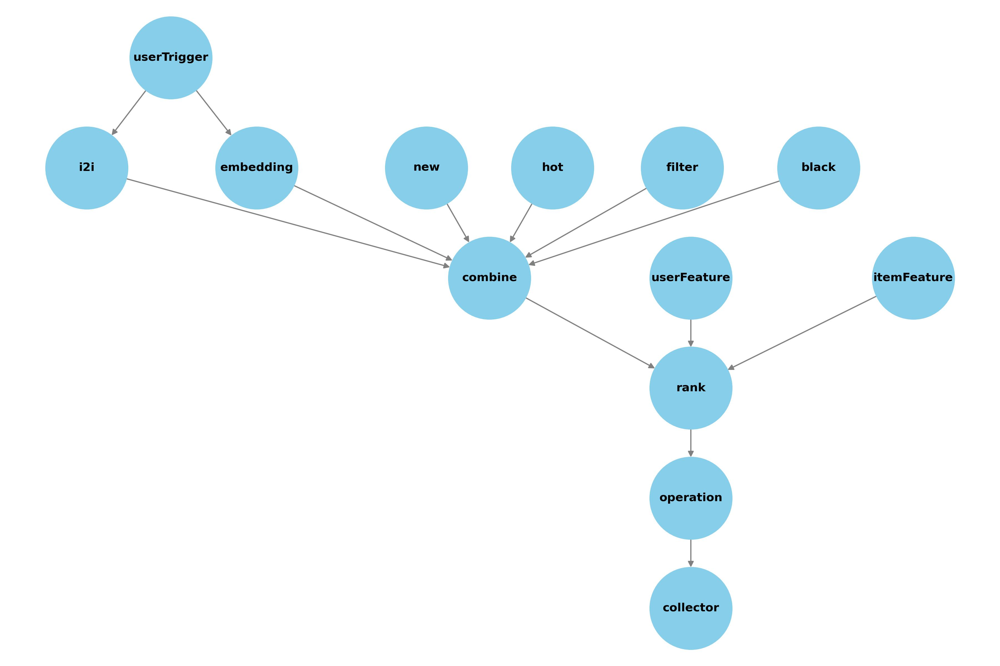
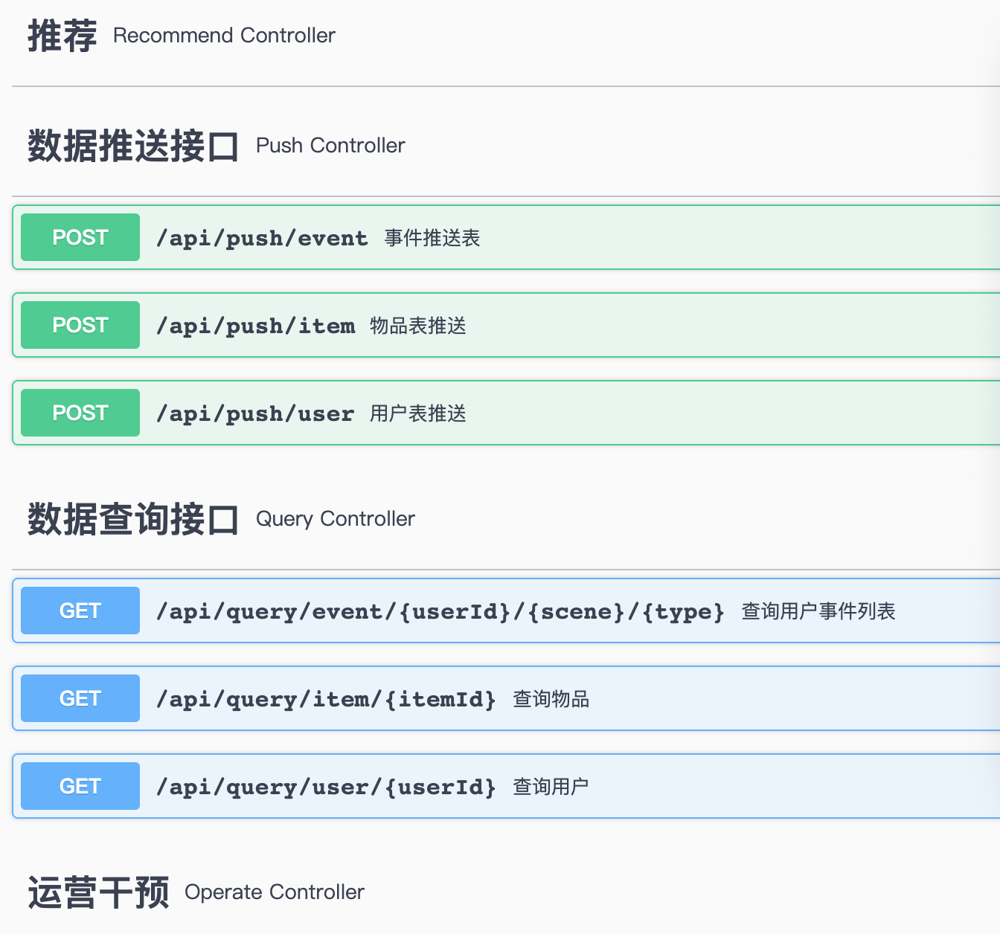

# rec-server

The online recommendation service of open-rec. A request comes in, a configurable DAG of recall /
filter / rank / operation nodes executes against Redis and Elasticsearch, and a ranked item list
comes back.

Java 8, Spring Boot 2.3.1 with WebFlux, listening on port 13579.

## modules

Directory names differ from artifactIds:

| Directory | artifactId | Contents |
|---|---|---|
| [graph](graph) | `rec-graph` | the generic async DAG engine — no recommendation logic |
| [proto](proto) | `rec-proto` | request/response protocol shared with `rec-client` |
| [contrib](contrib) | `rec-contrib` | pf4j plugin module for custom operation rules |
| [server](server) | `rec-online-server` | the service: nodes, controllers, storage access |



## build

```shell
mvn clean package -DskipTests
```

Use `mvn clean install -DskipTests` instead if you also need `rec-proto` in your local Maven repo —
[sdk](https://github.com/open-rec/sdk)'s `rec-client` and `example/init` both depend on it.

The runnable jar lands at `server/target/rec-server-1.0-SNAPSHOT.jar` (the `finalName` differs from
the artifactId).

## run

Requires Redis and Elasticsearch. See
[example_standalone](https://github.com/open-rec/example/tree/master/example_standalone) for the
supported infrastructure setup, index initialization, and a full walkthrough including sample data.

```shell
cd server
java -jar target/rec-server-1.0-SNAPSHOT.jar --spring.profiles.active=standalone
```

Any property can be overridden on the command line, which is handy for secrets you do not want in
the properties file:

```shell
java -jar target/rec-server-1.0-SNAPSHOT.jar --spring.profiles.active=standalone '--es.password=<your-password>'
```

Install the operation-rule plugin used by the default graph — `OperationRuleManager` loads it from
`<working-dir>/plugins/`, so it must sit next to wherever you launch the jar:

```shell
mkdir -p server/plugins
cp contrib/target/rec-contrib-1.0-SNAPSHOT.jar server/plugins/
```

Without it, the service remains available but the operation node logs a warning and passes candidates
straight through, so the configured channel allocation is not applied. Override the location with
`-Dopenrec.operation.plugin=/absolute/path/rec-contrib-1.0-SNAPSHOT.jar` when needed.

### containers

The repository also owns self-contained standalone and cluster deployments. Its multi-stage build
packages the server and operation plugin; no host Maven build or JDK is required. Start the matching
`bigdata-platform` infrastructure preset first so the external `openrec-bigdata` network and
dependency services exist, then run one of:

```shell
docker compose -f docker-compose.standalone.yml up -d --build --wait
docker compose -f docker-compose.cluster.yml up -d --build --wait
```

Standalone connects only to Redis and Elasticsearch, writes pushes directly to Redis, and bypasses
ranking. Cluster additionally connects to `rank-engine` and the Kafka brokers. Both use Compose
network names rather than host-published ports. Override `ELASTIC_PASSWORD` when the platform
password differs from the local example default. These files can run independently or be included
by a composing example.

### verify

```shell
curl http://localhost:13579/health

curl -s -X POST http://localhost:13579/api/recommend/item \
  -H 'Content-Type: application/json' -d '{
  "requestId": "test-1",
  "body": {"scene": "scene_0", "size": 10, "userId": "user_247", "deviceId": "d1", "type": "click", "debug": true}
}'
```

Swagger UI: http://localhost:13579/swagger-ui/index.html



## configuration

Collector synthetic exposure is controlled by `collector.fake-expose.enabled`. It remains enabled
in `application-standalone.properties`, where returning a recommendation is treated as exposure
without a separate client event. It is disabled in `application-cluster.properties`; cluster clients
send real `expose` events through the Push API only after items are actually displayed. Collector
still merges, truncates, and returns recommendation results in both modes.

`server/src/main/resources/`:

| File | Purpose |
|---|---|
| `application.properties` | selects the active profile |
| `application-standalone.properties` | local: pushes data straight to Redis and disables the rank service |
| `application-cluster.properties` | pushes data to Kafka and uses the rank service |
| `graph.json` | the DAG — nodes, their config and the edges between them |
| `logback.xml` | logging |

| Property | Default | Notes |
|---|---|---|
| `server.port` | 13579 | |
| `server.pushService` | `pushRedisService` (dev) | which `PushService` bean the push API uses |
| `redis.hostName` / `redis.port` | 127.0.0.1 / 6379 | |
| `es.host` / `es.port` | 127.0.0.1 / 9200 | Elasticsearch 8 requires `https`; self-signed certs are trusted |
| `es.user` / `es.password` | elastic / — | set your own; ES 8 does not auto-generate one when started with `-d` |
| `rank.host` / `rank.port` | 127.0.0.1 / 8123 | [rank-engine](https://github.com/open-rec/rank-engine), optional |
| `spring.kafka.bootstrap-servers` | localhost:9092 | only used by the `prod` profile |

### recall store

The graph nodes depend on the storage-neutral `RecallStore` service. Both standalone and cluster
use `ElasticsearchRecallStore` by default. Hot, new, and i2i read stable aliases:

```text
openrec-recall-hot-active
openrec-recall-new-active
openrec-recall-i2i-active
```

Physical indexes carry the offline table version but not the scene, for example
`openrec-recall-i2i-20260819-r001`; every query filters on the `scene` field. Select the
implementation with `recall.store=elasticsearch|redis`, or `RECALL_STORE` in either Compose
deployment. `RedisRecallStore` is documented as development-only because its mutable sorted sets do
not support version switching; it remains available for local debugging and parity tests. Redis still
owns online entities, events, exposure filters, and blacklists. Embedding recall
continues to use its existing per-scene Elasticsearch index (`{scene}-item-vector-index`). A custom
implementation only needs to provide another `RecallStore` bean and select its own property value.

Standalone setups need neither Kafka nor the rank engine.

## api

| Method | Path | Purpose |
|---|---|---|
| POST | `/api/recommend` | compatibility alias for item recommendations |
| POST | `/api/recommend/item` | recommend items; debug details are `Item` objects |
| POST | `/api/recommend/user` | reserved user-recommendation contract; currently returns 501 |
| POST | `/api/push/{user,item,event}` | ingest data |
| GET | `/api/query/user/{userId}` | read back a user |
| GET | `/api/query/item/{itemId}` | read back an item |

The endpoint owns `targetType` (`item` or `user`). User recommendation deliberately has no serving
implementation yet; its entity schema, relationship model, recall, filtering and ranking semantics
must be designed before it is connected to a graph.

Cluster pushes use a versioned Kafka mutation envelope. `INSERT` and `UPDATE` require the normal
entity body; `DELETE` for item/user requires only `id` (an item may optionally include `scene`).
Event deletion is intentionally unsupported.

`dislike` uses a structured `Event.value`; `id` and `category` are single values and `tags` is a
list. At least one field is required:

```json
{"userId":"user_1","itemId":"item_10","scene":"scene_0","type":"dislike",
 "time":"1787292000","value":"{\"id\":\"item_10\",\"category\":\"sports\",\"tags\":[\"nba\",\"cba\"]}"}
```

The online projection expands this into `id:item_10`, `category:sports`, `tag:nba`, and `tag:cba`
members of `event:{user_1}:scene_0:dislike`. The default BlackNode reads 30 days/1000 rules. A field
should only be sent when the user selected that scope; disliking one item must not implicitly block
all of its category or tags.

```json
{"schemaVersion":1,"entityType":"item","operation":"DELETE",
 "occurredAt":1787292000000,"data":{"id":"item_123"}}
```

Kafka records are keyed by item/user ID, preserving mutation order per entity. Consumers remain
compatible with legacy bare-entity JSON. Redis and HBase apply deletes immediately, while HDFS keeps
the envelope as an immutable tombstone; cumulative offline reads select the latest mutation and
exclude deleted entities so older partitions cannot resurrect them.
| GET | `/api/query/event/{userId}/{scene}/{type}` | read back a user's events |
| POST | `/api/operate/blacklist` | set the item blacklist |
| GET | `/health` | liveness |

Every request body is wrapped in `JsonReq<T>` and every response in `JsonRes<T>`; see
[proto](proto). [rec-client](https://github.com/open-rec/sdk) is a ready-made Java client.

Set `"debug": true` on a recommend request to get item details attached to the response.

## the request DAG

`graph.json` declares the nodes and edges; `GraphEngine` builds and runs them per request. The
default graph:

```
userTrigger ──> i2i ─────┐
            └──> embedding ─┤
                    hot ─────┤
                    new ─────┼──> combine ──> rank ──> operation ──> collector
                 filter ─────┤        ↑
                  black ─────┘        │
                          userFeature ─┤
                          itemFeature ─┘
```

| Node | Role |
|---|---|
| `userTrigger` | recent clicks from Redis, plus any `itemIds` on the request, used as triggers |
| `i2i` | item-to-item recall from `i2i:{itemId}:{scene}` |
| `embedding` | averages trigger vectors, kNN search in Elasticsearch |
| `hot` / `new` | popularity and freshness recall |
| `filter` | drops items exposed to this user recently |
| `black` | reads the global item blacklist and current user's dislike ID/category/tag rules (on by default) |
| `combine` | merges candidates, then removes exposed, globally blacklisted, disliked, triggered, missing, disabled and cross-scene items |
| `itemFeature` | independent item-feature preparation hook reserved for ranking |
| `rank` | scores via [rank-engine](https://github.com/open-rec/rank-engine); failures degrade to recall order |
| `operation` | applies a pf4j `OperationRule` plugin |
| `collector` | truncates to the requested `size`, writes a synthetic expose record |

Each node has a `timeout` in milliseconds. When it is exceeded the engine cancels the node and the
channel silently contributes nothing — a request still succeeds. If a recall channel reports 0 items,
compare its logged latency against its `timeout` before suspecting the data: `embedding`'s default of
100ms is shorter than a cold TLS handshake to Elasticsearch.

`server/src/main/resources/graph.json` remains the startup default. In cluster mode, rec-console can
publish a complete replacement to `POST /internal/serving-graph`; rec-server parses node content,
validates node classes, constructors, edges and acyclicity, then atomically swaps the graph used by
new requests. In-flight requests retain their original snapshot. `GET /internal/serving-graph`
returns the active version, checksum and full graph. Both calls require `X-OpenRec-Token`, configured
through `SERVING_GRAPH_TOKEN`. Node-level editing and version rollback belong to rec-console; this
service deliberately accepts only full graph snapshots.

To change the packaged fallback, edit `graph.json` and repackage. Regenerate its diagram with
`bash server/bin/update_graph.sh` (needs `networkx`, `matplotlib`, graphviz).

Details on writing a node: [graph](graph). Details on custom operation rules: [contrib](contrib).

## test

```shell
mvn -pl graph test                              # standalone JUnit, no services needed
mvn -pl graph test -Dtest=GraphEngineTest       # a single class
mvn -pl server test -Dtest=FilterNodeTest#run   # a single method
```

Tests under `server/src/test` are `@SpringBootTest` and hit **live** Redis / Elasticsearch / Kafka;
they fail without those running, which is why the build commands above use `-DskipTests`.

## function points

<table>
	<tr>
	    <th>Biz</th>
	    <th>Detail</th>
	    <th>Status</th>  
	</tr >
	<tr >
	    <td rowspan="4">recall</td>
	    <td>i2i</td>
	    <td>✅</td>
	</tr>
	<tr>
	    <td>embedding</td>
	    <td>✅</td>
	</tr>
	<tr>
	    <td>hot</td>
	    <td>✅</td>
	</tr>
	<tr>
	    <td>new</td>
	    <td>✅</td>
	</tr>
    <tr >
	    <td rowspan="3">operation</td>
	    <td>blacklist</td>
	    <td>✅</td>
	</tr>
	<tr>
	    <td>exposure filter</td>
	    <td>✅</td>
	</tr>
	<tr>
	    <td>custom operation plugins</td>
	    <td>✅</td>
	</tr>
    <tr>
	    <td>rank</td>
	    <td>LR</td>
        <td>✅</td>
	</tr>
    <tr>
	    <td>tools</td>
	    <td>debug info</td>
        <td>✅</td>
	</tr>
</table>
